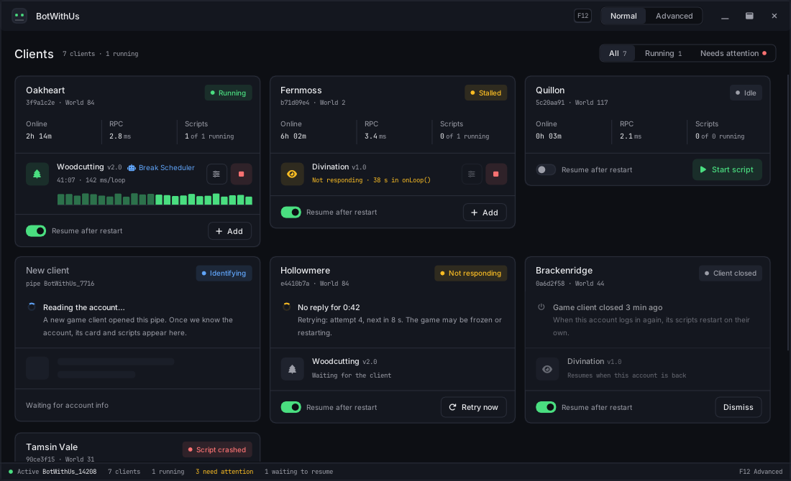
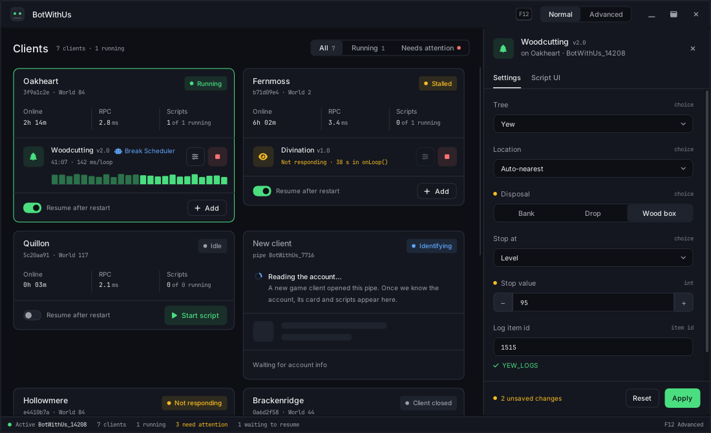
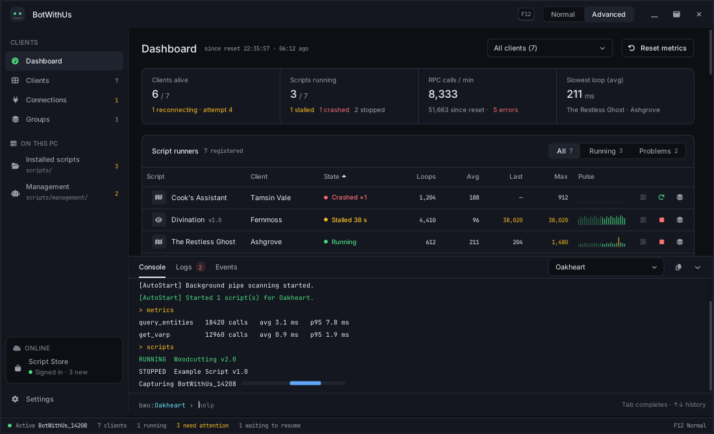
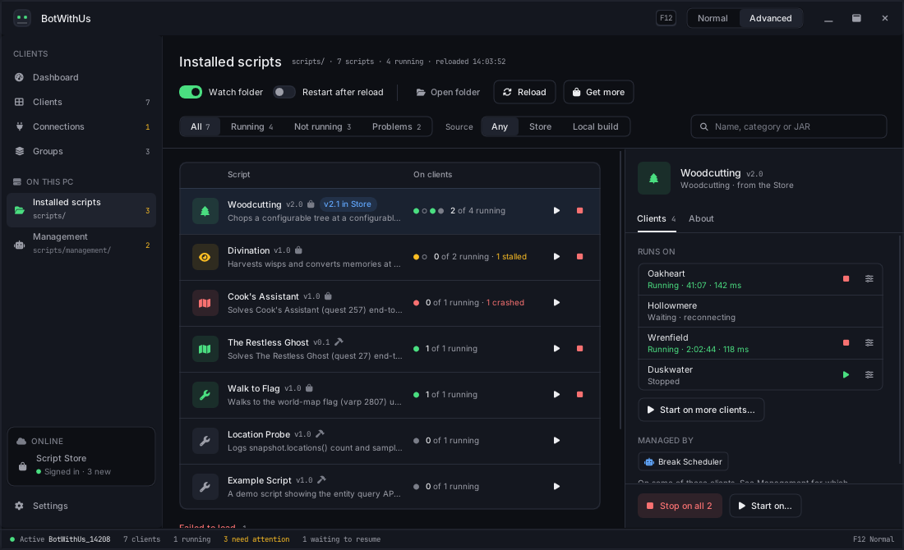

# JBotWithUsV2

A modular Java 21 game scripting framework that communicates with a game server via Windows named pipes using MessagePack-encoded JSON-RPC. Scripts are dynamically discovered at runtime via Java's ServiceLoader SPI and execute on virtual threads.

## Requirements

- Java 25 (auto-provisioned by Gradle's toolchain — no manual install needed if Gradle has network access)
- Windows (named pipe + shared-memory transports)
- Gradle 9.5+ (included via wrapper)

## Quick Start

```bash
# Build all modules
./gradlew build

# Run the GUI application
./gradlew :cli:run
```

The GUI has a Normal mode for everyday use and an Advanced mode with the host's full set of pages; see [The GUI](#the-gui).

## The GUI

`./gradlew :cli:run` opens the host's window. It has two modes that share one shell: the top bar, the status bar along the bottom, the config inspector and the pop-up notifications. **F12** switches between them, and Settings chooses which one the window opens in.

**Normal mode** is the everyday view: one card per game-client account. A card shows the account, its world, how long it has been online, its average RPC latency and each of its scripts, and a running script ends in a pulse lane of its last 24 loop times, so a slow loop stands out without reading a number. Cards follow the account rather than the pipe. A client that stops answering keeps its card and shows its retries. A client that closes keeps its card too, and with **Resume after restart** on, its scripts start again when the account logs back in, on whatever pipe it comes back on.



A script's settings open in the **config inspector**, docked on the right. It has two tabs: **Settings**, with the script's typed fields, and **Script UI**, with the script's own ImGui (see [Script UI](#script-ui)).



**Advanced mode** adds a sidebar with the host's pages:

| Sidebar | Page | What it is for |
|---|---|---|
| Clients | Dashboard | Every script runner in one table, RPC latency by method, what needs attention, the script folder's watch and reload, and a dock with the console, the logs and the host's events |
| | Clients | The Normal-mode cards |
| | Connections | Every pipe the host sees (connected, reconnecting, found or closed), its history, the retry controls, and which connection the console runs commands on |
| | Groups | Named sets of accounts to start and stop scripts on together, each optionally run by a management script |
| On this PC | Installed scripts | The JARs in `scripts/`: where each one runs, which failed to load, and starting one on several clients at once |
| | Management | Host-level management scripts, what each one applies to, and a log of what they did |
| Online | Script Store | The scripts you subscribe to on BotWithUs, installed through the launcher |
| Foot of the sidebar | Settings | Every host setting, saved as you change it to `~/.botwithus/config.properties`, including alerts to ntfy, Slack or Discord |





The screenshots are rendered from fixture data, not from a live game. `./gradlew :cli:renderPreviews` renders every page and state the same way, into `cli/build/preview/`, so a UI change can be checked without a game client. `./gradlew :cli:previewSmokeTest` does the same render and fails if any page throws or draws nothing. Both open a window, so they need a desktop session.

## Module Architecture

Five Gradle subprojects with strict dependency layering:

```
api                 (slf4j-api)                — Public interfaces, models, snapshot view, query builders
  ↑ required by
core                (api + msgpack + logback   — Pipe + SHM transport, RPC client, script runtime,
                     + panama)                   cache + pathfinder bridges
  ↑ required by                                ↑
cli                 (api + core + imgui)       test-support  (api)
                                               — Mocks for downstream script projects
example-script      (api only)                 — Example BotScript implementations
```

### api

Pure interface module whose only dependency is `slf4j-api` (exposed transitively so scripts get SLF4J for free). Contains `BotScript` (the SPI), `Client` / `ClientProvider`, `GameAPI` (slim RPC surface composed of `SystemAPI` / `ActionAPI` / `NavigationAPI` for mutations and state probes), `GameSnapshot` (the tick-scoped read view backed by shared memory), fluent entity query builders (`Npcs`, `Players`, `SceneObjects`, `GroundItems`, `WorldMapElements`), inventory wrappers (`Backpack`, `Bank`, `Equipment`), an event bus, and inter-script communication via `MessageBus`.

> **Reads vs writes.** Live state (local player, NPCs, players, locations, inventories) is read from `Client.snapshot()` — a per-tick shared-memory view, no RPC round-trip. `GameAPI` is for mutations, login/break controls, client-script execution, and cache-type lookups.

Key packages:
- **`blueprint`** — Visual graph workflow model (`BlueprintGraph`, `NodeInstance`, `Link`, `PinDefinition`)
- **`config`** — Script configuration fields (`ConfigField`, `ScriptConfig`)
- **`constants`** — Game constant registries (`InterfaceIds`, `InventoryIds`, `AnimationIds`)
- **`entities`** — Fluent query builders and `EntityContext` wrapper with lazy-cached info, distance calculations, health/animation/combat state
- **`isc`** — Inter-script communication (`MessageBus` with request/response, `SharedState` thread-safe key-value store)
- **`log`** — Structured logging API (`BotLogger` → SLF4J delegation, `LoggerFactory`, `LogLevel`)
- **`model`** — Domain models including `Personality` (humanizer profile with live session stats)
- **`script`** — `ManagementScript` SPI, `ScriptScheduler`, `TaskScript`, `ClientOrchestrator`
- **`ui`** — `ScriptUI` interface for custom ImGui-based script UIs
- **`util`** — Timing helpers (`Timing.gaussianRandom`, `Conditions.waitForAnimation`, `Humanize`)

### core

Runtime and communication layer. Owns both transports: Windows named pipe I/O (`pipe/PipeClient`, `\\.\pipe\BotWithUs_<pid>`) for synchronous msgpack JSON-RPC (`rpc/RpcClient`), and the shared-memory mapping (`shm/SharedRegion`, `Local\nxt_snapshot_<pid>`) that exposes the producer's per-tick snapshot + event ring. Discovers script JARs from the `scripts/` directory (`runtime/LocalScriptLoader`) and runs each script on a virtual thread (`runtime/ScriptRuntime`, `runtime/ScriptRunner`).

Key features:
- **RPC timeouts** — Configurable per-call timeouts with `RpcTimeoutException`
- **Retry** — `RetryPolicy` with exponential backoff for transient RPC failures
- **Metrics** — `RpcMetrics` tracks call count, latency, and error rate per method
- **Profiling** — `ScriptProfiler` tracks loop timing (avg/min/max/last)
- **Error isolation** — Per-phase error handling in `ScriptRunner` (onStart/onLoop/onStop)
- **Structured logging** — SLF4J + Logback with MDC-based context tagging (`script.name`, `connection.name`)
- **GUI log bridge** — Custom `LogBufferAppender` feeds Logback events into the in-memory `LogBuffer` for the GUI log panel

### cli

ImGui-based GUI with ANSI color support and a command system. Supports multiple simultaneous pipe connections, custom script UI rendering, and management script orchestration.

Commands:

| Command | Aliases | Description |
|---------|---------|-------------|
| `connect` | | Connect to a game server pipe |
| `disconnect` | | Disconnect from a pipe |
| `scripts` | `s` | List / start / stop / restart scripts, view info / config / status |
| `mgmt` | `management`, `m` | Manage management scripts (list, start, stop, restart, reload, info) |
| `client` | `cm`, `clients` | Manage clients, groups, and cross-client script operations |
| `stream` | `sv` | Start/stop live game video streaming with quality/fps/resolution options |
| `screenshot` | | Capture a screenshot |
| `logs` | | View log output |
| `metrics` | | View RPC call statistics (latency, error rates) |
| `profile` | `prof` | View per-script loop timing data |
| `config` | `cfg` | Show or change host settings (`~/.botwithus/config.properties`); `config set <key> <value>` saves at once |
| `actions` | | Inspect the game action queue, history, and blocked state |
| `events` | | Monitor event bus subscriptions and publish counts |
| `player` | `self`, `pos` | Print local player position and state from the snapshot (`player skills` for the skills table) |
| `autostart` | | Manage per-account script auto-start profiles |
| `reload` | | Reload scripts; `--start` starts them all, `--watch` toggles the folder watch (the `autoReload` setting) |
| `mount` / `unmount` | | Mount/unmount script directories |
| `ping` | | Ping the game server |
| `help` | | Show available commands |
| `clear` | | Clear the console |
| `exit` | | Exit the application |

The commands run in the console on the Advanced-mode Dashboard. The GUI's modes and pages are described in [The GUI](#the-gui).

### example-script

Reference implementations: `ExampleScript` (Script UI demo with status display, controls, and entity summary table), `WoodcuttingFletcherScript`, `LocationProbeScript` (smoke test against the live producer's scene Locations table), `WalkToFlagScript`, and `DivinationScript`. Building this module automatically installs the JAR to the `scripts/` directory.

### test-support

Published as `bot-test-support`. Mocks for downstream script projects to unit-test against the API: `MockGameAPI`, `MockScriptContext`, `CannedSnapshot`, `InMemoryEventBus`.

## Writing a Script

Scripts implement the `BotScript` SPI and are packaged as Java modules.

```java
import org.slf4j.Logger;
import org.slf4j.LoggerFactory;

@ScriptManifest(
    name = "My Script",
    version = "1.0",
    author = "You",
    description = "Does something useful"
)
public class MyScript implements BotScript {

    private static final Logger log = LoggerFactory.getLogger(MyScript.class);
    private ScriptContext ctx;

    @Override
    public void onStart(ScriptContext ctx) {
        this.ctx = ctx;
        log.info("Started!");
        // Initialize state, subscribe to events
    }

    @Override
    public int onLoop() {
        GameAPI api = ctx.getGameAPI();
        GameSnapshot snap = api.snapshot();         // tick-scoped read view (SHM-backed)
        // Read live state from the snapshot, mutate via api
        if (snap != null && snap.self() != null) {
            // ...
        }
        return 1000; // delay in ms before next loop, or -1 to stop
    }

    @Override
    public void onStop() {
        log.info("Stopped.");
    }
}
```

SLF4J is available transitively from the API module — no extra dependency needed. Log output from scripts is automatically tagged with the script name and connection via MDC.

Your `module-info.java` must declare the service provider:

```java
module my.script {
    requires com.botwithus.bot.api;
    provides com.botwithus.bot.api.BotScript with my.script.MyScript;
}
```

Place the compiled JAR in the `scripts/` directory. The runtime discovers and loads it automatically.

## Management Scripts

Management scripts run independently of any single client and can coordinate across all connected clients. Use these for multi-account orchestration, group rotation, cross-client monitoring, and scheduled workflows.

```java
@ScriptManifest(name = "GroupRotator", version = "1.0",
        description = "Rotates scripts across client groups")
public class GroupRotator implements ManagementScript {

    private ClientOrchestrator orchestrator;

    @Override
    public void onStart(ManagementContext ctx) {
        orchestrator = ctx.getOrchestrator();
        orchestrator.createGroup("skillers", "Skilling accounts");
    }

    @Override
    public int onLoop() {
        orchestrator.startScriptOnGroup("skillers", "Woodcutter");
        return 60_000; // check every minute
    }

    @Override
    public void onStop() {
        orchestrator.stopAllScriptsOnAll();
    }
}
```

Declare the SPI in `module-info.java`:

```java
provides com.botwithus.bot.api.script.ManagementScript with my.script.GroupRotator;
```

### Targets: what a management script can reach

Each management script is applied to a set of targets that the user picks on the host: the **whole host**, one or more **groups**, and single **client scripts** (one script on one client's account). The orchestrator and client provider a script gets are limited to those targets:

- Lists (`getClientNames`, `getStatusAll`, `listScheduled`, `getGroupNames`, …) leave out whatever the targets do not cover.
- A call that would act on something outside them fails with a result whose message is `not in this script's targets`. It never throws. A call over a group or over every client acts on the covered part.
- Only a script targeting the whole host may create, delete or change groups.
- A group target makes the script that group's manager. When the user stops everything on the group, its manager is paused there. It can still see the group and stop scripts on it, but it starts nothing there until it is resumed.
- A script with no targets can still run, but it sees no clients.

`ManagementContext.targets()` returns the targets as they are now. They can change while the script runs, so read them when you need them. Management scripts that were installed before targets existed are given the whole host the first time the host loads them, so they keep working as before.

### Settings per target

A management script's settings have **defaults**, which every target uses, and each group or client-script target can have values of its own; the inspector's *Settings for* picker edits either. For a given client, a value comes from the first of these that sets it:

1. the client script's own value;
2. the value of a group the client is in, if that group is also one of the script's targets;
3. the defaults.

Setting a target's value back to the one it would inherit removes it, so the target follows its group or the defaults again. A script that manages the whole host uses only the defaults.

`onConfigUpdate` receives the defaults, as it always has. To act on one client with that client's values, ask the context:

```java
ScriptConfig forOakheart = ctx.configFor(accountUuid);               // the account's merged settings
ScriptConfig forItsWoodcutting = ctx.configFor(accountUuid, "Woodcutting"); // one script on it
int breakEvery = forOakheart.getInt("breakEvery", 90);
```

A target's values can change without `onConfigUpdate` being called, so read them when you act rather than keeping them. The host keeps them under `~/.botwithus/config/__management/<script>/`: `defaults.json` and one file per target with values of its own. A management script's settings file from before per-target settings becomes its `defaults.json` the first time the host reads it, and the old file is kept beside it with a `.bak` suffix.

### Script Scheduling

ManagementScripts schedule scripts through `ClientOrchestrator`. The orchestrator owns per-client targeting, so each call states *which* client(s) the schedule applies to. Single-client, group, and all-client variants exist for one-shot (`scheduleScript` / `scheduleScriptAt`) and recurring (`scheduleScriptEvery`) operations, each with optional `Map<String, Object>` config for the started script:

```java
// One-shot in 10 minutes on a specific client
orchestrator.scheduleScript("Account1", "Woodcutter", Duration.ofMinutes(10));

// Scheduled start at a specific instant on every client in a group
orchestrator.scheduleScriptOnGroupAt("Skillers", "Fisher", Instant.parse("2026-03-09T14:00:00Z"));

// Recurring every 2h across the whole fleet
orchestrator.scheduleScriptOnAllEvery("Miner", Duration.ofHours(2));

// Recurring with auto-stop after 5 min per cycle, group-wide
orchestrator.scheduleScriptOnGroupEvery("Skillers", "Crafter",
        Duration.ofMinutes(30), Duration.ofMinutes(5));

// Cancel by id, or wipe everything
orchestrator.cancelSchedule("Account1", scheduleId);
orchestrator.cancelAllSchedules();

// Observe scheduled state
orchestrator.listScheduled().forEach(e ->
        log.info("{}: {} next at {}", e.clientName(), e.scriptName(), e.nextRun()));
```

`ScriptScheduler` itself remains a framework-internal type — each instance is bound to one Connection's runtime, and the orchestrator routes calls to the right one.

## Script UI

Scripts can provide custom ImGui-based UI that renders in the config inspector's **Script UI** tab. Override `getUI()` to return a `ScriptUI` implementation:

```java
import imgui.ImGui;
import com.botwithus.bot.api.ui.ScriptUI;

@Override
public ScriptUI getUI() {
    return () -> {
        ImGui.text("Status: running");
        if (ImGui.button("Do something")) {
            // handle click
        }
        ImGui.progressBar(progress, -1, 0, "Progress");
    };
}
```

The full ImGui API is available — collapsing headers, tables, trees, inputs, tabs, etc. Add `requires imgui.binding;` to your `module-info.java` and `compileOnly("io.github.spair:imgui-java-binding:1.90.0")` to your build dependencies. The imgui module is already loaded at runtime by the host application.

```java
module my.script {
    requires com.botwithus.bot.api;
    requires imgui.binding;
    provides com.botwithus.bot.api.BotScript with my.script.MyScript;
}
```

The `render()` method is called every frame on the UI thread while the script's inspector shows its Script UI tab. The tab is offered only to scripts whose `getUI()` returns a UI, and a script with a UI but no settings opens its inspector on that tab.

## Live Config

Scripts expose runtime-editable parameters by overriding two methods on `BotScript`:

```java
@Override
public List<ConfigField> getConfigFields() {
    return List.of(
            ConfigField.intField("loopDelay", "Loop Delay (ms)", 5000),
            ConfigField.boolField("verbose", "Verbose Logging", true),
            ConfigField.choiceField("mode", "Operating Mode",
                    List.of("Passive", "Active", "Aggressive"), "Passive"),
            ConfigField.itemIdField("axeId", "Axe Item ID", 1351),
            ConfigField.stringField("greeting", "Greeting Text", "hello"));
}

@Override
public void onConfigUpdate(ScriptConfig config) {
    this.loopDelay = config.getInt("loopDelay", 5000);
    this.verbose = config.getBoolean("verbose", true);
    this.mode = config.getString("mode", "Passive");
}
```

`ConfigField` supports five kinds: `INT`, `STRING`, `BOOLEAN`, `CHOICE`, and `ITEM_ID`. The inspector's **Settings** tab renders a typed widget per field — a stepper for `INT`, a number field for `ITEM_ID` with the item's name under it, text input for `STRING`, a switch for `BOOLEAN`, and a segmented control or dropdown for `CHOICE`. Open it with **Configure** on a client card, the settings button in the Scripts list, or `scripts config <name>` in the console; management scripts open theirs from the Management page.

`onConfigUpdate(ScriptConfig)` fires twice:

1. **At startup** — once the saved config is loaded from disk (or the defaults if nothing is persisted yet). This happens before `onLoop` begins.
2. **At runtime** — every time the user clicks "Apply" in the config inspector. The script keeps running; treat this as a hot reload of your tuning knobs.

Persistence: configs are written to `~/.botwithus/config/<scriptName>.json` after every "Apply". The same file is read at script start. Editing the JSON by hand works — the change picks up on next start. Delete the file to reset to declared defaults.

## Personality & Humanization

The `Personality` profile provides per-user behavioral characteristics and live session stats. Scripts can use this to adapt timing, click precision, and break scheduling for more human-like behavior.

```java
Personality p = api.getPersonality();
double reactionMultiplier = p.timing().reactionSpeed(); // 0.7–1.5
double fatigue = p.session().fatigueLevel();            // 0.0–1.0
String risk = p.session().riskLevel();                  // "low", "moderate", "high", "critical"
```

Personality traits include speed, path curvature, precision, tremor, timing, fatigue resistance, and camera movement characteristics.

## Build Commands

```bash
./gradlew build                    # Build all modules (installs example-script to scripts/)
./gradlew clean build              # Clean and rebuild
./gradlew :cli:run                 # Run the GUI application
./gradlew :example-script:build    # Build and install example script only
./gradlew test                     # Run all tests
./gradlew :cli:renderPreviews      # Render every GUI page and state from fixtures to cli/build/preview/
./gradlew :cli:previewSmokeTest    # The same render; fails if a page throws or draws nothing
```

## Auto-Start System

The auto-start system remembers which scripts were running on each account and can automatically restart them on reconnect. Profiles are stored as `.properties` files in `~/.botwithus/profiles/`.

### How It Works

1. When you connect to a pipe, the app probes for account info (display name)
2. If a profile exists for that account, the configured scripts are auto-started
3. When scripts are started or stopped, the profile is automatically updated
4. On app shutdown, all running script states are saved

### File Layout

```
~/.botwithus/
├── config.properties                 # Host settings (autoConnect, autoConnectPipes, scanIntervalMs, ...)
├── clients.json                      # Remembered clients: account UUID, name, last world
├── groups.json                       # Client groups: members by account UUID, optional manager
├── groups.v1.json                    # The pre-UUID groups file, kept once it has been migrated
├── start-when-back.json              # Scripts queued to start on clients that are not connected
└── profiles/
    ├── PlayerOne.properties          # Per-account: scripts=Script1,Script2  autoStart=true
    ├── PlayerTwo.properties
    └── groups/
        └── farm1.properties          # Per-group: scripts=WoodcuttingScript  autoStart=true
```

### Commands

```bash
autostart list                        # Show all account/group profiles
autostart add <script>                # Add script to current account's auto-start
autostart remove <script>             # Remove script from auto-start
autostart enable / disable            # Toggle auto-start for current account
autostart save                        # Save current running scripts as profile
autostart clear [account]             # Clear a profile
autostart group <name> add <script>   # Add script to group auto-start
autostart group <name> list           # List scripts in a group
autostart settings                    # Show the auto-connect settings
autostart on / off                    # Enable/disable background pipe scanning
```

When enabled (`autostart on`, the `autoConnect` setting, or the switch in Settings), the app scans for new pipes in the background and automatically connects, identifies accounts, and starts their configured scripts. Turning it off stops the scanner at once. The pipe prefix (`autoConnectPipes`) and scan interval (`scanIntervalMs`) are read on every scan, so `config set` changes apply without a restart.

Earlier versions kept the auto-connect settings in `~/.botwithus/autostart.properties`. On first start the host copies them into `config.properties` and renames the old file to `autostart.properties.bak`.

## Communication Flow

The producer (an injected C++ DLL) exposes two transports under the same `<pid>` suffix; both bind together via `Client`:

```
                          ┌──────────────────────────────┐
                          │  Injected NXTLibrary DLL     │
                          │  (game process, per-pid)     │
                          └─────────┬────────────────┬───┘
                                    │                │
              \\.\pipe\BotWithUs_<pid>      Local\nxt_snapshot_<pid>
                  (msgpack JSON-RPC)        (per-tick snapshot + event ring)
                                    │                │
       ┌──── mutations / probes ────┘                └──── live reads ─────┐
       ▼                                                                   ▼
  BotScript → GameAPI → RpcClient → PipeClient                  Client.snapshot() → GameSnapshot
                                                                                    (via SharedRegion)
```

- **Pipe (RPC)**: length-prefixed MessagePack frames, synchronous request/response. Used for mutations, login/break control, action queueing, navigation, client-script execution, and cache-type lookups.
- **SHM (snapshot + events)**: `core/shm/SharedRegion` maps the producer's double-buffered snapshot region; readers honour acquire-load on `frontIdx` and per-slot `seq` so reads tear-free. The event ring carries push-style notifications consumed by `EventBus`. `Layout.PROTOCOL_VERSION` must match the producer's `kProtocolVersion`.

## Testing

```bash
./gradlew test                     # Run all tests
./gradlew :core:test               # Run core module tests only
```

Tests cover MessagePack codec, RPC metrics, event bus, message bus, script runner/runtime, script profiler, script profile persistence, auto-start command, connection groups, and end-to-end transport with a mock game server.

## Using the API in your own project

The `api` module is published as `com.botwithus:bot-api` to a static Maven
repository hosted at [BotWithUs/maven](https://github.com/BotWithUs/maven) and
served over GitHub Pages. It resolves anonymously — no token, no login:

```kotlin
repositories {
    mavenCentral()
    maven { url = uri("https://botwithus.github.io/maven") }
}

dependencies {
    implementation("com.botwithus:bot-api:1.0.0")
}
```

Sources and Javadoc jars are published alongside each release, so IDEs pick up
documentation and step-through sources automatically.

### Cutting a release

Releases are tagged, and the tag drives the version:

```bash
git tag v1.2.0
git push origin v1.2.0
```

That tag does three things: publishes `bot-api` to the Maven repository,
redeploys the Javadoc so the docs match the version just published, and cuts a
[GitHub release](https://github.com/BotWithUs/BWUJavaScriptingFramework/releases)
carrying the jar, sources, and javadoc. Builds without `-PreleaseVersion` stay on
`1.0-SNAPSHOT`, which is never published. Published versions are immutable — the workflow fails rather than
overwrite one, so a bad release is corrected by cutting the next version.


### Contributing

Pull requests target `master`, the integration branch. `master` is protected: changes
land only through a pull request with a green CI build, and the branch cannot be
force-pushed or deleted. No approving review is required; the maintainer reviews and
merges each PR. CI builds and tests `api`, `core`, `test-support`,
`quest-core` and `skilling-core` — the modules that compile from a bare clone;
`cli` and the script modules need machine-specific paths in `local.properties`.

Release tags cannot be moved or deleted once pushed, so a published version is
never silently replaced.

## API Documentation

Javadoc is generated for the API module and published to GitHub Pages. Build locally with:

```bash
./gradlew :api:javadoc
```

## Troubleshooting

**Pipe not found.** Connect fails with "no pipe matching `\\.\pipe\BotWithUs_*` found". The agent DLL hasn't injected, or it injected into a different client PID. Confirm the game client is running, the agent loaded successfully, and the PID matches. `PipeClient.firstAvailableOrThrow` walks `\\.\pipe\` and picks the first match — if multiple game clients are running, pass an explicit pipe name to `connect`.

**Protocol-version mismatch.** Connect succeeds but reads fail immediately with "shared region protocol version X, expected Y" — the consumer (`Layout.PROTOCOL_VERSION`) and the producer (`kProtocolVersion` in `NXTLibrary/src/ipc/SharedLayout.h`) drifted. Rebuild both sides from matching commits; `SharedRegion.open()` refuses to map a region whose version byte doesn't match.

**Missing `provides` clause.** A JAR is placed in `scripts/` but doesn't show up in the Scripts panel. The most common cause is forgetting `provides com.botwithus.bot.api.BotScript with my.script.MyScript;` in the script's `module-info.java`. `LocalScriptLoader` emits a WARN-level log line when a module-bearing JAR contains no `BotScript` provider — check the log to confirm.

**Reloading while you develop.** With the `autoReload` setting on (`reload --watch`, `config set autoReload true`, or the switch in Settings) the host watches `scripts/` and `scripts/management/` and reloads whichever changed when a JAR is added, rebuilt or deleted. A plain reload leaves the reloaded scripts stopped; turn on `scripts.restartAfterReload` to start again exactly the scripts each client was running before, or pass `reload --start` to start every script. A script that was running but is gone after the reload is reported, not restarted.

**Two builds of one script.** If two JARs declare the same module, the one modified most recently is loaded and the other is listed as a failed load that names the newer JAR. If two different modules declare the same `@ScriptManifest` name, both load, the newer one takes the name, and the older is listed as a duplicate. Either way, delete the older JAR.

**Scripts folder discovery order.** `LocalScriptLoader.resolveScriptsDir()` checks the `botwithus.scripts.dir` system property first; if unset, it looks for a `scripts/` subdirectory of the current working directory; if that is missing, it falls back to `~/.botwithus/scripts`. Parent directories are **not** searched — every JAR found is loaded as fully-trusted code with no signature check, so searching upward would let a `scripts/` planted in any ancestor of the working directory take over. If your script JAR isn't being picked up, the most common cause is running the CLI from a different working directory — set `-Dbotwithus.scripts.dir=/absolute/path/to/scripts` or check the log for the resolved path.
